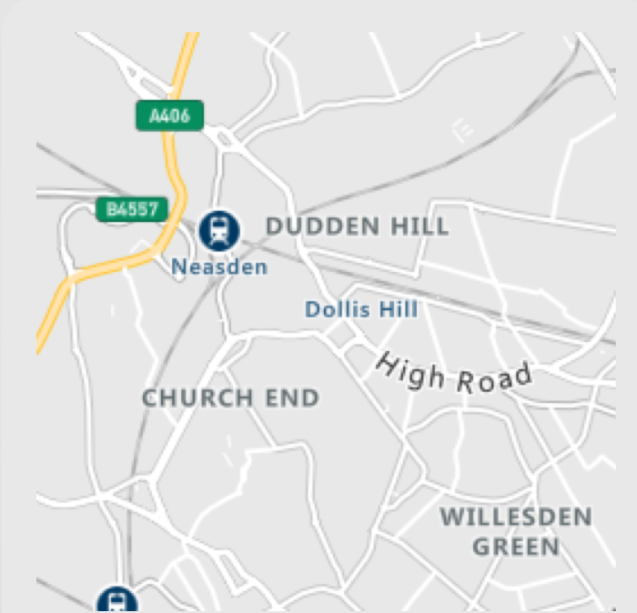
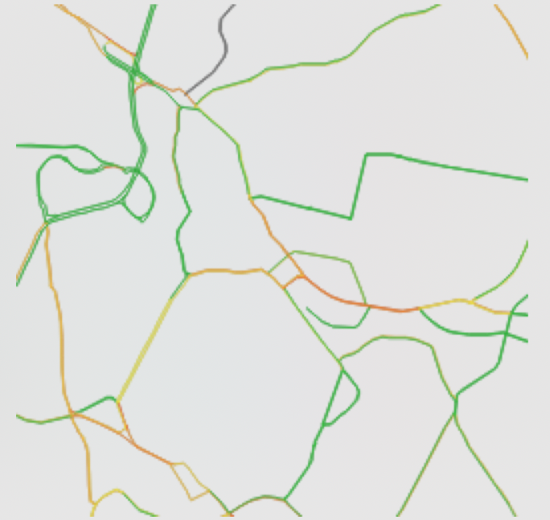
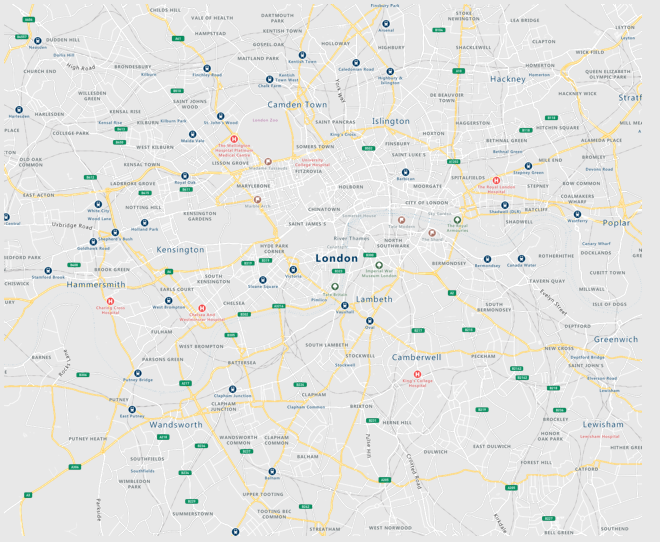
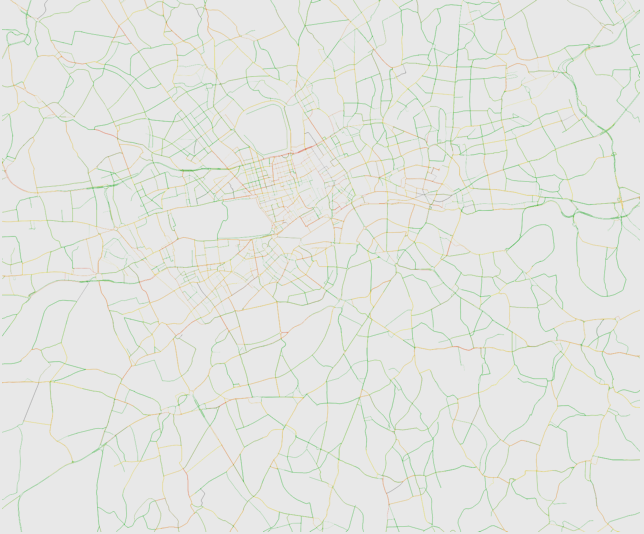
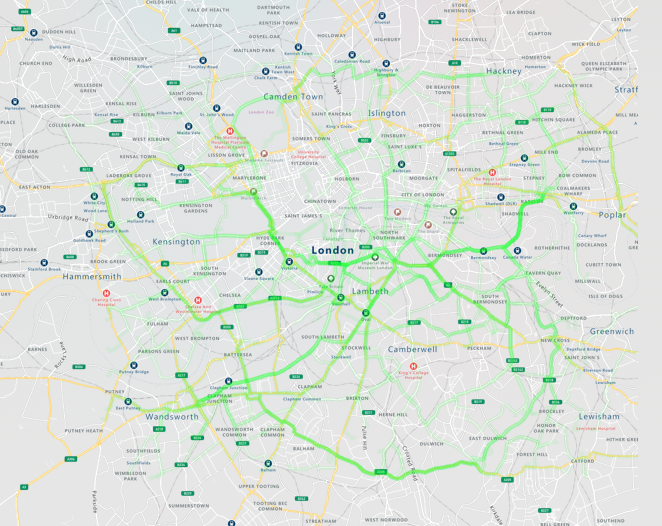
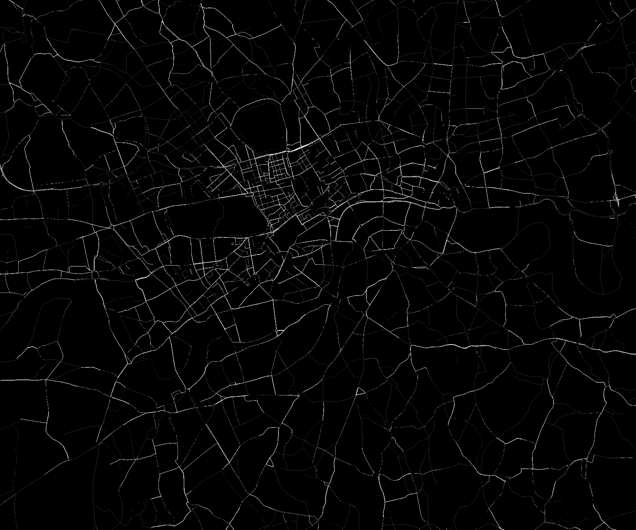

# Exploring Azure Maps traffic information

## Define area of interest

Edit `box` in `code/settings.py` to define the area of interest (e.g. rectangle containing a city).

## Azure Maps service

Create an Azure Maps service (S0) tier.

## Run all

`export MAPS_KEY=[Azure Maps Key]`

`run-all.sh` runs all the scripts below in sequence.

## Download map

`code/download-map-tiles.py` downloads tiles at the given zoom level.

## Download real-time traffic

`code/download-traffic-tiles.py` downloads real-time traffic tiles at the given zoom level.

## Stitch images

`code/stitch-images.py` stitches the map and traffic tiles into a single large image.

## Generate random routes

`code/download-routes.py` generates 100 random pairs of points within the `box` and calls Azure Maps to obtain real-time route information (including estimated traffic delay).

## Draw downloaded random routes

`code/draw-routes.py` draws the 100 routes on the map, using transparency. More intensely colored roads have more routes passing through them.

## Quantize traffic

`code/quantize-traffic.py` transforms the traffic image from green-yellow-amber-red scale to grayscale with:
* if intensity = 0: no traffic information (i.e. pixel is not a road, or no traffic info for that road)
* if intensity between 1 and 255: intensity reflects traffic

